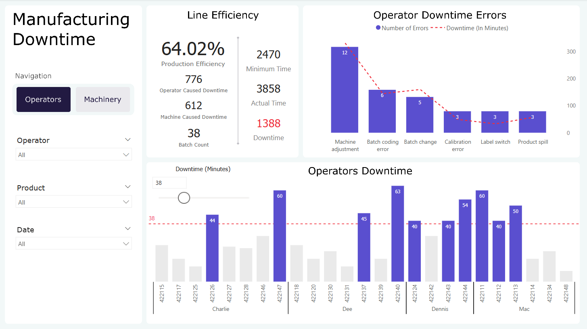
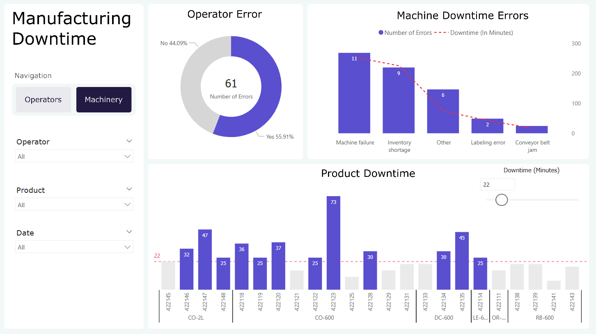

# DEPI Capstone Project : Manufacturing Downtime Analysis

## Overview

This analysis evaluates the production efficiency of our manufacturing line,
highlighting key insights and opportunities for optimization.

---

## Data Description

1. Line Productivity (Fact Table)

| Field      | Description                                   |
| ---------- | --------------------------------------------- |
| Date       | Date the batch was produced                   |
| Product    | Product ID for the item produced in the batch |
| Batch      | Unique identifier for each production batch   |
| Operator   | Operator in charge of the batch               |
| Start Time | Time when the batch production started        |
| End Time   | Time when the batch production ended          |

2.  Products (Dimension Table)

| Field          | Description                                               |
| -------------- | --------------------------------------------------------- |
| Product        | Unique product ID                                         |
| Flavor         | Soda flavor                                               |
| Size           | Product volume/size                                       |
| Min batch time | Minimum time required to produce a batch (ideal scenario) |

3. Line Downtime (Fact Table)

| Field           | Description                                           |
| --------------- | ----------------------------------------------------- |
| Batch           | Batch ID corresponding to the production batch        |
| Downtime factor | Downtime minutes categorized by each factor (columns) |

#### Notes

> **Note:** Downtime factors are stored as multiple columns — one column per factor.

4. Downtime Factors (Dimension Table)

| Field          | Description                                               |
| -------------- | --------------------------------------------------------- |
| Factor         | Unique ID for each downtime factor                        |
| Description    | Description of the downtime cause                         |
| Operator Error | Indicates whether the issue was operator-related (Yes/No) |

---

## Data Transformation

-   Merged the **Line Downtime** table with the **Downtime Factors** table to resolve issues with certain DAX measures.
-   Unpivoted the **Line Downtime** columns to enable better analysis of downtime factors.
-   Calculated a **Duration** column from batch start and end times to compare actual production time with the minimum required batch time.
-   Adjusted data types to ensure consistency and reliability across the dataset.

---

## Data Model

---

## Dashboards

-   First Dashboard measuring operators performance

-   Second Dashboard measuring machines efficiency

---

## Key Findings

-   **Overall Efficiency:**  
    Production efficiency was relatively low at **64.02%**, signaling clear opportunities for improvement in both **operational processes** and **resource management**.

-   **Downtime Timing:**  
    Downtime was most heavily concentrated between **10 AM and 3 PM**, indicating a critical window for **targeted interventions** or **process optimization**.

-   **Human vs. Machine Impact:**  
    Operator-related issues accounted for approximately **56%** of total downtime, suggesting human factors had a greater impact than equipment failures. **Improved training** and **standardized procedures** could lead to significant performance gains.

-   **Key Machine-Related Issues:**  
    The most common machine-related problems were:

    -   **Inventory Shortage** (>200 minutes)
    -   **Machine Failure** (>250 minutes)  
        These point to potential weaknesses in **material planning** and **preventive maintenance**.

-   **Top Downtime Cause:**  
    The **largest single downtime factor** was **Machine Adjustment Error** (332 minutes), which is operator-driven. This underscores the need for **better setup protocols** and **skill development**.

-   **Product Insight:**  
    No strong correlation was found between specific products and increased downtime. Although **Coke 600 ml** had the highest total downtime, this was due to its higher number of batches rather than product-specific issues.

-   **Operator Performance:**  
    Operator batch counts were relatively consistent, showing **no significant performance discrepancies** between individuals.

-   **Interactive Benchmarking:**  
    A **dynamic reference line** was added to one of the visuals, enabling users to **adjust benchmarks interactively** and quickly assess outliers or underperforming values.

## Team Members and LinkedIn Profiles

-   [Abdullah Mohammed Ibrahim](https://www.linkedin.com/in/abdullah-elhelw/)
-   [Abdelrahman Yasser Saeid](https://www.linkedin.com/in/abdelrahman-yasser-1ab5b0235/)
-   [Anas Mohammed Mansour](https://www.linkedin.com/in/anas-mohamed-mansour/)
-   [Ahmed Omar Mohammed](https://www.linkedin.com/in/ahmed-omar-2b847729b/)
